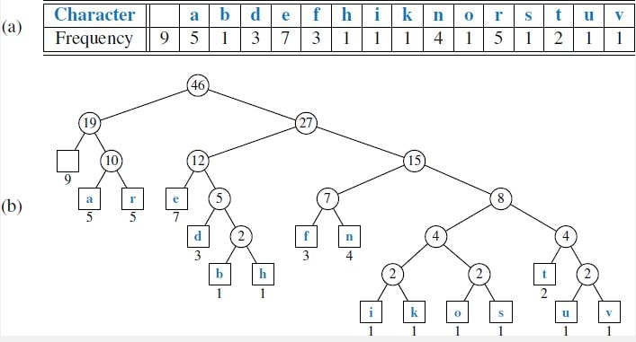

# Codes

## Background

[Codes](https://en.wikipedia.org/wiki/Code) are used to convert data from one representation to 
another, usually by mapping symbols in the source alphabet to "code words" in a target alphabet. 
For example, we could convert Latin letters to binary digits (bits) via the following code:

`C = {a -> 0, b -> 01, c -> 10, ...}`

Note that the code words may contain multiple symbols, 
i.e. they are strings over the target alphabet `{0, 1}`.

A desirable property of codes is that the encoded data is often shorter than the original source, 
i.e. [data compression](https://en.wikipedia.org/wiki/Data_compression), although this is 
[not possible](https://matt.might.net/articles/why-infinite-or-guaranteed-file-compression-is-impossible/) 
for all inputs without [loss](https://en.wikipedia.org/wiki/Lossy_compression) 
due to the pigeonhole principle.

Another desirable property of codes is the *prefix-property*, 
which requires that no code word is a prefix of another code word. 
This makes it easy to decode the encoded data without ambiguity.
Codes with this property are known as [prefix codes](https://en.wikipedia.org/wiki/Prefix_code).

The study of codes is referred to as [coding theory](https://en.wikipedia.org/wiki/Coding_theory).

## Huffman Coding

We will focus on [Huffman coding](https://en.wikipedia.org/wiki/Huffman_coding), 
which is not a specific code, but rather an algorithm for producing efficient codes for source data 
where the probability distribution of symbols in the source alphabet is known (or estimated).

A Huffman code is represented as a rooted binary tree *T*, 
where each leaf node represents a symbol from the source alphabet. 
The code word for this leaf node is given by the path from the root to the leaf, 
where each edge is labeled `0` if it connects a parent node to its left child, 
and `1` if it connects a parent node to its right child.
Note that the use of leaves guarantees the prefix property, 
because the path from the root to a leaf cannot contain any other leaves.

The other key idea is that more common symbols should be placed closer to the root, 
so that they are given shorter code words. Uncommon symbols may be far from the root. 
This minimizes the total number of bits needed for some typical input data.
For example, a Huffman code for the Latin alphabet might assign `e -> 011` and `z -> 100110`. 

For example, the following image displays a frequency table for some English characters 
and the corresponding Huffman tree:

Consult the [wikipedia page on Huffman coding](https://en.wikipedia.org/wiki/Huffman_coding), 
which describes the algorithm to produce optimal trees.

## Assignment

In this assignment, you will implement Huffman coding via the following algorithms:
- Construct a Huffman tree from a given probability distribution over the source alphabet.
- Build a dictionary mapping from source symbols to code words (bitstrings).
- Encode a string of source data
- Decode a string of encoded data

Taken together, these functions can be used to generate a 
[codec](https://en.wikipedia.org/wiki/Codec) (encoder/decoder) for any source distribution.

Please complete the functions in `huffman.py`, following the docstrings and examples (doctests).
Running `python3 huffman.py` will run the doctests, which produce no output on a successful run.
You can also use pytest as normal, which will run the more extensive `test_huffman.py`.

### Dependencies

We will use the [bitstring](https://pypi.org/project/bitstring/) package for working directly with 
bitstrings. Please install it using `python3 -m pip install -r requirements.txt`. 
Refer to the [bitstring docs](https://bitstring.readthedocs.io/en/latest/) for usage instructions.

You may use modules from the Python standard library, such as `heapq`, as necessary.
