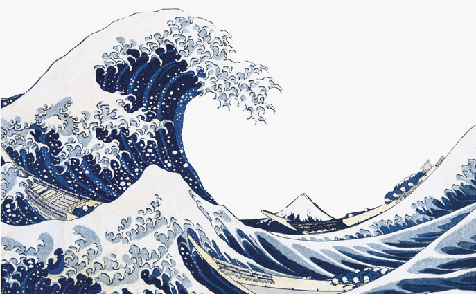
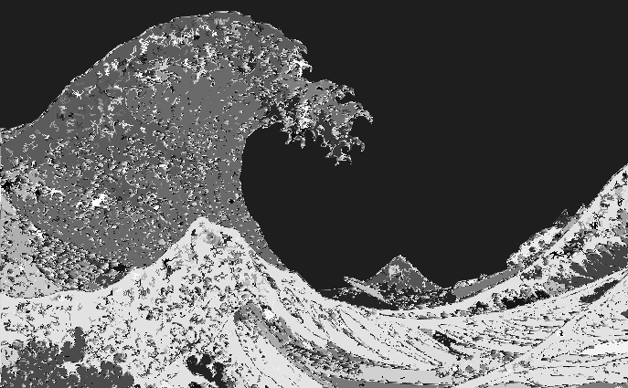

# Image Segmentation

This assignment is based on the image segmentation algorithm presented in this paper (optional read):
https://link.springer.com/content/pdf/10.1023/B:VISI.0000022288.19776.77.pdf

The goal of image segmentation is to split an image into multiple segments
where the pixels in each segment are more "similar" to each other than to the 
pixels in neighboring segments.  Various definitions of "similar" can be used
depending on the task.  In this assignment, we will be focusing on grayscale images 
(each pixel is represented by a value from 0 to 255, where 0 is black and 255 is white),
and our definition of "similar" will be the absolute difference of the grayscale value 
of two pixels.

Here is an example where we segment a PNG of "The Great Wave Off Kanagawa":




And here is another where we segment a PNG of a smiling face emoji:


The main idea for creating segments is based on Kruskal's algorithm for creating MSTs.
In Kruskal's, each vertex starts as its own tree.  Then trees are connected by finding
the lowest weight edge that does not form a cycle.  This edge is added to the set of edges in the MST
and the trees are combined.  Kruskal's stops once an MST is formed.

Image segmentation similarly starts by assigning each pixel to its own segment.
Each pixel has an "edge" between it and its neighboring pixels, whose weight is the difference
in grayscale values between the pixels.
Segments are combined by finding the lowest weight edge that does not form a cycle.
The image segmentation algorithm has an additional check before combing segments:
segments are combined only if the weight of the edge connecting them
is less than the largest difference in grayscale values in the segment.
This represents only combining two segments if the pixels along the edge of the segments
are as similar to each other as the pixels within the segment.
Finally, the algorithm stops once all edges are checked.  Note that an MST is not formed; if it were, then the
image would just be one segment!

## Algorithm

First, convert the input `image` (a 2D `np.ndarray`) into an undirected, weighted graph.
There should be a vertex for every pixel `(x,y)` in the graph.
There should be an edge from every pixel to its top-left, top, top-right, left, right, bottom-left, bottom, and bottom-right neighbor.
This means every vertex (except those at the edge of the picture) should have 8 edges.
The weight of an edge from pixel `(a,b)` to pixel `(x,y)` should be `abs(image[a,b] - image[x,y])`, the absolute difference
of the grayscale value for the pixel `(a,b)` and the pixel `(x,y)`.

Second, run a modified Kruskal's algorithm to create the segments.
1. Assign each pixel to its own segment.
2. Sort the edges by weight, call the sorted edges `{e1, e2, ..., en}`
3. For `e` in `{e1, e2, ..., en}`
   1. Let `U`, `V` be the segments connected by `e`.
   2. If `U` and `V` are the same segment (cycle), then do nothing
   3. If `weight(e) <= min(MaxDiff(U) + k / Size(U), MaxDiff(V) + k / Size(V))`, then combine `U` and `V` into one segment
   4. If `weight(e) > min(MaxDiff(U) + k / Size(U), MaxDiff(V) + k / Size(V))`, then do nothing

`Size(U)` is the number of vertices in the segment `U`.  `MaxDiff(U)` is the difference between the grayscale values of the
vertex with the highest grayscale value in `U` and the vertex with the lowest grayscale value in `U`. `k` is an adjustable parameter
that is given as an input to the algorithm which affects how many segments are created.  A higher `k` generally leads to
more segments being combined, leading to fewer separate segments in the result.

Third, convert the graph back to a `np.ndarray` where each entry contains an integer representing
which segment the pixel belongs to.  Pixels belonging to the same segment should have the same label.
The labels can be any integer.

## Assignment
In `segment.py` implement the function `segment_image()` which will take a 2D `np.ndarray` containing
numbers from 0 to 255 representing a grayscale image, and the parameter `k` described above.  `segment.py` 
will create a graph representation of the image and run the algorithm described
above to create segments.  It should output an `np.ndarray` where each entry is an integer label for a segment.

We have provided a partially implemented `UnionFind` class you may find useful to use.  
You do not need to finish implementing it or pass the tests in `test_unionfind.py` for full credit.

The functions in `utils.py` are mainly for loading and saving images and testing.  You do not need to understand
how they work to complete the assignment.

## Testing and Running
Before you run, make sure you have all the packages you need with `python -m pip install -r requirements.txt`.

We have provided some tests for you in `tests/` that can be run with `pytest tests`.  To run a specific test case,
for example test case 3 of `test_zero_k`, you can run `pytest tests/test_zero_k.py::test_zero_k[3]`.

Once the algorithm has been implemented, running the below should generate `wave_segmented.png` and `smiling_segmented.png`:
```
import utils
utils.load_segment_save_image(9, "wave.png", "wave_segmented.png")
utils.load_segment_save_image(3, "smiling.png", "smiling_segmented.png")
```

This function loads the image, converts it into grayscale, passes it to `segment_image()`,
converts the labeled result back into a grayscale image, and saves it. Do not worry if the images do not exactly match, 
but the output PNGs should visually look segmented.
